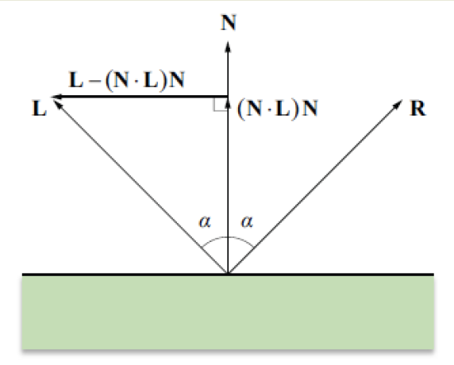
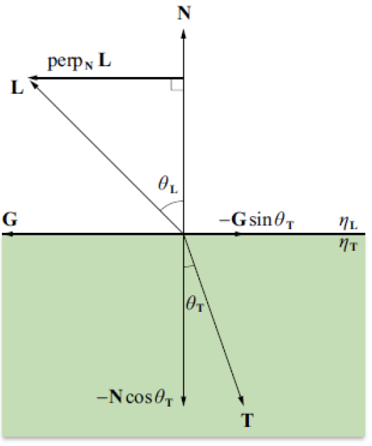

##《图形绘制技术》作业1 光线追踪 
202220005 顾馨兰
gu_xinlan@163.com
April 2021

---
[TOC]

###总览
####实验要求
**已完成**：实现光线追踪算法，支持平面（用三角形表示）、球体和带底面的圆柱体，支持反射和折射，物体带有包围盒（Axis-Aligned Bounding Box, AABB）。
**待后续完成**：支持任意几何体（用obj文件表示）；实现加速算法；物体和相机的Transformation。
####实验效果
低采样率输出：`./output1.ppm`
分辨率：640 * 480，采样率：1，在开发设备上渲染时间约20s。 


高采样率输出：`./output2.ppm` 
分辨率：1280 * 960，采样率：50，在开发设备上渲染时间约1h。
 


####开发环境
- CPU: 2.3GHz Intel Core i5; 内存: 8GB
- MacOS10.14 / VSCode / C++
- 向量计算使用Eigen库。
####主要参考资料
- 《图形绘制技术》课件；
- GAMES101课件及作业框架代码；
- *Ray Tracing in One Weekend.*

###代码框架
- Renderer.hpp：渲染器类。
```java
class Renderer{
    int width, height;                      //图像大小（成像平面为z=0）
    vector<Vector3d> buffer;                //存储每个像素的颜色
    void render(Scene& scene);              //遍历每个像素，按采样率发出一条或多条光线
    Vector3f trace(Ray& ray, Scene& scene); //递归计算光线与场景相交得到的颜色
    Vector3f shade(Scene& scene, 
                Vector3f& point, 
                Vector3f& normal, 
                Material& mat);             //按照Blinn-Phong模型计算某一交点的shading
    void write(string filename);            //将buffer中的像素颜色写入文件
};
```
- Scene.hpp：场景类：含一组物体，一组光源，一个相机。
```java
class Scene{
    vector<Surface*> objects;
    vector<Light*> lights;
    Camera camera;          //目前固定在(0,0,-5),朝向+z方向
};
```
- Object.hpp：定义所有图元的基类Surface。每个图元都有材质、包围盒、光线求交函数接口。
```java
class Surface{
    Material* material;
    Bounds3 bounds;
    virtual bool intersect(const Ray& ray, float& t) = 0;
};
```
图元派生类继承关系如下：
```
- Surface
   - ImplicitSurface: 可用f(x,y,z)=0表示的表面
        - Sphere
        - Cylinder
    - Triangle: 单个三角形表面
    - TriangleMesh: 由多个三角形组成的表面
```
- Material.hpp: 材质基类。
```java
class Material{
    Vector3f ks, kd, ka;                        //着色系数
    float attenuation;                          //次级光线衰减系数
    virtual bool reflect(const Vector3f& d_in,
                     const Vector3f& normal, 
                     Vector3f& d_out) = 0;      //计算反射方向
    virtual bool refract(const Vector3f& d_in, 
                    const Vector3f& normal, 
                    Vector3f& d_out) = 0;       //计算折射方向
};
```
继承关系：
```
- Material
   - Lambertian: 漫反射（随机方向），无折射
   - Metal: 镜面反射，无折射
   - Dialectric: 有折射和镜面反射
```
- Bounds3.hpp: 包围盒（AABB）类。
```java
class Bounds3{
    Vector3f pMin, pMax;            //用极小点坐标和极大点坐标表示范围
    bool intersect(const Ray& ray); //判断光线是否与包围盒相交
};
```
- Light.hpp: 点光源类。保存光源颜色、坐标、强度。
- Ray.hpp: 光线类。保存一条光线的起点坐标、方向向量，并给出r(t)的计算函数：$r(t) = o + td,  t \geq 0$
- Camera.hpp: 相机类。保存坐标、LookAt方向、Up方向、fov视角大小。
- Utils.hpp: 定义常用变量和辅助函数，包括二次方程求根、度数弧度转换等。
- main.cpp: 编写测试场景中的图元及渲染参数。
###核心算法
以下使用伪代码进行描述。
####光线递归
1. primary ray: 由相机发出，穿过成像平面z=0的初级光线。使用随机采样的方法为每个像素点生成numSamples条光线。
```java
void Renderer::render(scene){
    for (x,y) in image do:
        for s in numSamples do:    
            pixel_pos = (x+rand(), y+rand(), 0)       //rand()为(-1,1)间随机数
            Ray ray(cam_pos, pixel - cam_pos)
            color += trace(ray, scene)
        color /= numSamples
        buffer(x,y) = color
}
```
2. shadow ray：计算shading时由物体表面发出，指向光源的光线。如果该光线与场景无交点，则计算该点受该光源的局部光照，即该点的着色。代码见着色部分。

3. reflected ray：分为漫反射和镜面反射

漫反射：$R = N +random([-1,1]^3)$
```java
bool Lambertian::reflect(d_in, normal, d_out){
    d_out = normal + Vector3f::Random()        
    return true
}
```
镜面反射：$R = 2 (N\cdot L) N - L$，当$R\cdot N < 0$时无反射。
 

```java
bool getReflect (d_in, normal, d_out){
    //d_in的方向与公式中的L相反
    d_out = d_in - 2 * normal * normal.dot(d_in)  
    return d_out.dot(normal) > 0
}
```
4. refracted ray：根据Snell's law: $\eta_L sin\theta_L = \eta_T sin\theta_T$ 



令 $\eta = \dfrac{\eta_L}{\eta_T}$，折射光线为：$$T = \Big(\eta N \cdot L - \sqrt{1 - \eta^2[1 - (N\cdot L)^2]}\Big)N - \eta L$$ 其中 $sin\theta_L > \dfrac{1}{\eta}$ 时无折射。
```java

bool Dialectric::refract(d_in, normal, d_out){
    //d_in的方向与公式中的L相反
    cosi = d_in.dot(normal)    //入射方向与表面法向夹角
    if (cosi > 0) do:          //由物体内向空气中折射，表面法向应取反
        n = - normal
        eta = ref_idx / 1
    else:                      //由空气中向物体内折射
        n = normal
        eta = 1 / ref_idx

    sini = sqrt(1 - cosi * cosi)
    if (sini > 1 / eta) return false
    d_out = eta * (d_in - n * cosi) - n * sqrt(1 - eta * eta * sini * sini)
    return true
}
```
####图元与光线求交
1. Sphere
球面定义： $p:(p-c)^2-R^2=0$
光线求交即求方程$(o+td - c)^2 - R^2 = 0$的非负根。
```java
    bool Sphere::intersect(ray, t) {
        a = d.dot(d)
        b = 2 * (o - c).dot(d)
        c = (o - c).dot(o - c) - r * r
        if (!solveQuadratic(a,b,c,t0,t1)) return false
        if (t0 < 0 && t1 < 0) return false
        if (t0 > 0) t = t0 else t = t1
        return true
    }
```
2. Cylinder
圆柱体定义：$p:(p_x - c_x)^2 + (p_z - c_z)^2 -R^2=0, -h\leq p_y \leq h$
光线求交分别与顶面、底面、柱面相交，取最小的非负t。

```java
    bool Cylinder::intersect(ray, t) {
        o = o - c                       //将ray移到局部坐标系
        Ray rel_ray(o, d)
        t0 = (h - o.y()) / d.y()        //顶平面交点t0
        t1 = (- h - o.y()) / d.y()      //底平面交点t1

        a = d.x() * d.x() + d.y() * d.y()
        b = 2 * (o.x() * d.x() + o.z() * d.z())
        c = o.x()* o.x() + o.z() * o.z() - r * r

        if (!solveQuadratic(a,b,c,t2,t3)) do:   //柱面交点t2 t3
            t = find_tNear(rel_ray,t0,t1,-1,-1)
        else:
            t = find_tNear(rel_ray,t0,t1,t2,t3)      
            //找到交点在圆柱区域内最小的非负t，没有则返回-1
        return t>=0
    }
```
3. Triangle
三角形定义：$v0,v1,v2, N = (v1 - v0)\times(v2 - v1)$
所在平面：$p: (p - v0)\cdot N = 0$
光线与该平面求交：$t = \dfrac{(v0 - o)\cdot N}{d\cdot N}$
检查t非负且$p=r(t)$在三角形内，即检查p在三边的同侧，即$(v1 - v0)\times(p - v0)$, $(p - v1)\times(v0 - v1)$，$(p - v2)\times(v1 - v2)$三者两两点积为正。
```java
    bool Triangle::intersect(const Ray& ray, float& t) override{
        if (n.dot(d)==0) return false;
        t = n.dot(v0 - o) / n.dot(d);
        if (t < 0) return false;
        Vector3f p = ray.get(t);
        Vector3f cross0 = (p - v0).cross(v2 - v0);
        Vector3f cross1 = (p - v1).cross(v0 - v1);
        Vector3f cross2 = (p - v2).cross(v1 - v2);
        return cross0.dot(cross1)>=0 && cross1.dot(cross2)>=0;
    }
```
4. TriangleMesh：定义为一组三角形，求交时遍历所有三角形取最小非负t。
```java
class TriangleMesh:public Surface{
    vector<Triangle*> tris;
};
```
5. Bounds3 (AABB)
在x, y, z三个方向上求光线与AABB边缘的交点$\{t_{min}\}$和$\{t_{max}\}$.

与AABB相交范围：$t_{enter} = max\{t_{min}\}, t_{exit} = min\{t_{max}\}$.
当$t_{enter} \leq t_{exit}$且$t_{exit}\geq 0$ 时，光线与AABB有交点。
```java
    bool Bounds3::intersect(const Ray& ray){
        Vector3f o = ray.origin, d = ray.dir;

        float txmin = (pMin.x() - o.x())/d.x();
        float tymin = (pMin.y() - o.y())/d.y();
        float tzmin = (pMin.z() - o.z())/d.z();

        float txmax = (pMax.x() - o.x())/d.x();
        float tymax = (pMax.y() - o.y())/d.y();
        float tzmax = (pMax.z() - o.z())/d.z();

        if (txmin > txmax) swap(txmin, txmax);
        if (tymin > tymax) swap(tymin, tymax);
        if (tzmin > tzmax) swap(tzmin, tzmax);

        float t_enter = max(max(txmin, tymin), tzmin);
        float t_exit = min(min(txmax, tymax), tzmax);

        return t_enter <= t_exit && t_exit >= 0;
    }
```

####着色
1.Blinn-Phong Shading
N：表面法向
V：观察角度
L：光源角度
漫反射：只与N，L有关，与V无关$$L_d = k_d(I/r^2) max(0,N\cdot L)$$
高光：与N，V，L均有关
$$L_s = k_s(I/r^2) max(0,N\cdot H)^p$$其中半程向量$H =\frac{L+V}{|L+V|}$, p为衰减系数（这里统一取100）

环境光：与N，V，L均无关 $$L_a = k_a I_a$$
综合三式得到：$$L = L_a + \sum_{i=1}^{nls} (L_{di} + L_{si})$$
代码实现：
```java
Vector3f Renderer::shade(scene, point, n, mat){
    //mul_vec3()将两个向量分维度相乘
    color = mul_vec3(mat.ka, bgColor)               //ambient
    for light in scene.lights do:
        r = (light.pos - point).norm()
        I = light.intensity / (r*r)

        l = (light.pos - point).normalized()
        v = (cam.pos - point).normalized()
        h = (l + v).normalized()

        Ray shadow_ray(point,l)
        if (!hit(shadow_ray,scene)) do:
            diffuse = mat.kd * max(0.0f, l.dot(n)) * I
            specular = mat.ks * pow(max(0.0f, h_vec.dot(normal)), 100) * I
            color += mul_vec3(diffuse+specular, light.color)
    return color
}
```
2. Fresnel Reflection
在能够折射的物体表面同时有反射，使用菲涅尔方程计算反射与折射的比率，使得效果更好（此处参考了GAMES101作业框架代码，待进一步理解）。
```java
inline float fresnel(d_in, n, ref_idx){
    ...
    Rs = (nt * cosi - ni * cost) / (nt * cosi + ni * cost)
    Rp = (ni * cosi - nt * cost) / (ni * cosi + nt * cost)
    return (Rs * Rs + Rp * Rp)/2
}
```
3. 递归的着色思路：
```java

Vector3f Renderer::trace(Ray& ray, Scene& scene){
    p,n,mat = hit(ray,scene)
    if (!p) return bgColor              //无交点 返回背景色

    color = shade(scene, p, n, mat)     //Blinn-Phone shading

    kr = 1
    if (refract(...)) do:
        kr = fresnel(ray.dir, n, ref_idx) //若发生折射，计算反射率kr
        refracted = attenuation * mul_vec3(kd, trace(refracted_ray, scene)) //衰减率*物体本身颜色*折射光线返回结果

    if (reflect(...)) do:
        reflected = attenuation * mul_vec3(kd, trace(reflected_ray, scene)) //衰减率*物体本身颜色*反射光线返回结果

    color += reflected * kr + refracted * (1 - kr)  //按反射率kr加上反射和折射的颜色
    return color
}
```

###总结
- 关于光线传播的理论目前还理解较少，在实现中同时参考了两个不同的框架，关于shading和反射折射的公式可能用得有些混乱，需要进一步学习理解并改进。
- 场景还不太复杂但渲染时间已经较长，在后续实验过程中需要实现BVH加速结构，并寻找其他地方是否也有优化空间。